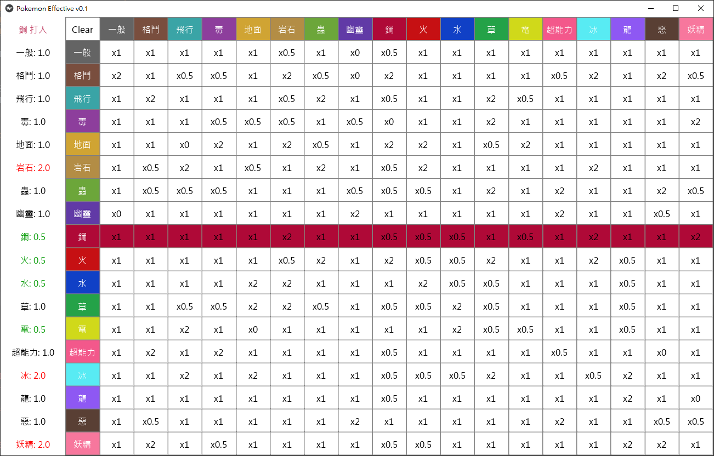
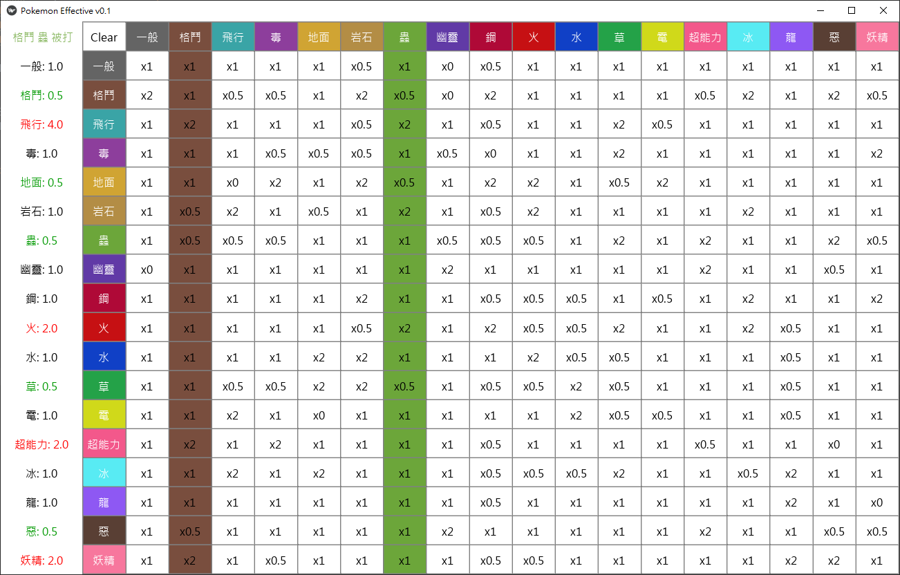
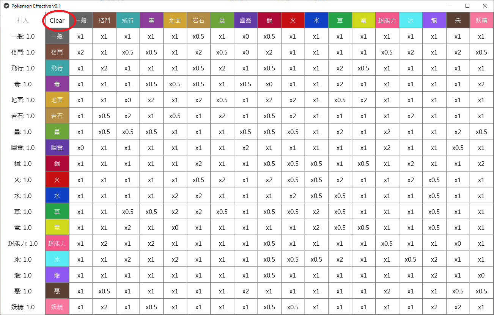

## 寶可夢屬性表
身為一位初出茅蘆的寶可夢訓練家，無法像寶可夢大師一樣將屬性表倒背如流又覺得網路上的屬性表當有雙屬性的時候實在是不太好看，索性當作練習使用python kivy 做了一個簡單的程式來幫我判斷相剋屬性。v。

如果你看到了這個屬性表真的很喜歡(應該不會有吧)但又不會用python的話可以寄信給我，我將執行檔傳給你

## 介面 & 用法
由於本人著實沒有美術天分不知道該怎麼美化他，因此這個招式表長得就和你找到的屬性表一模一樣
使用方法很簡單，你只要點選左邊(攻擊方)與上面(防禦方)有顏色的按鈕就可以將該行/列反白，並且會在最左邊顯示屬性倍率

點選左邊按鈕選擇攻擊方寶可夢招式屬性

點選上方按鈕選擇防禦方寶可夢屬性

按下左上角"Clear"按鈕就可以重製反白以及倍率囉！

最後就是這個程式有個小bug，左上角的文字顏色特別淡，但是我找不出問題在哪，如果有有緣人知道如何解決這鳥問題的話歡迎和我交流交流，感謝！
